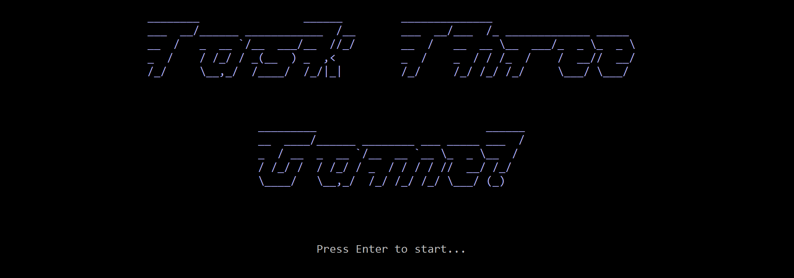
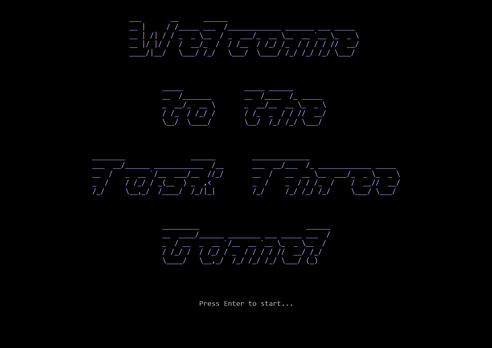
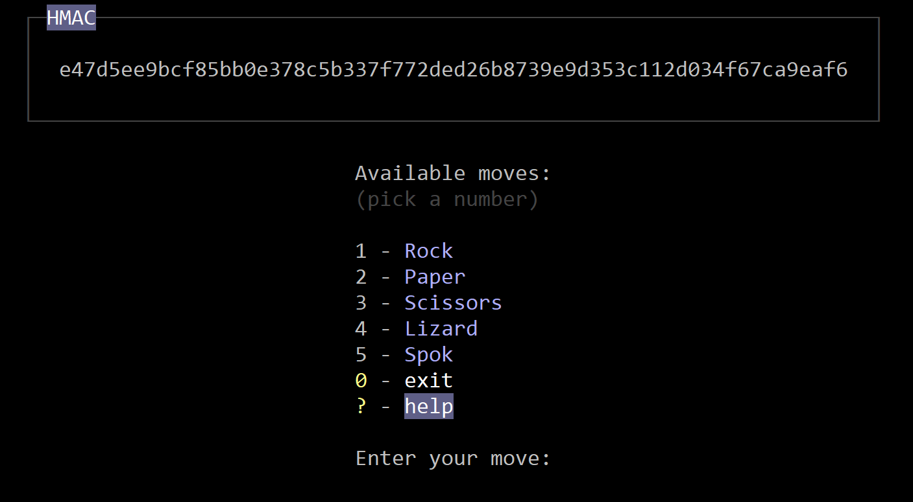
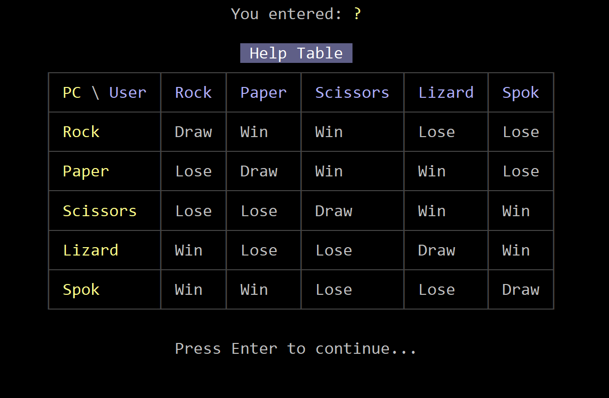
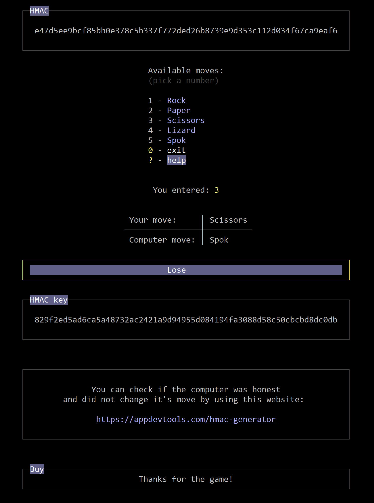
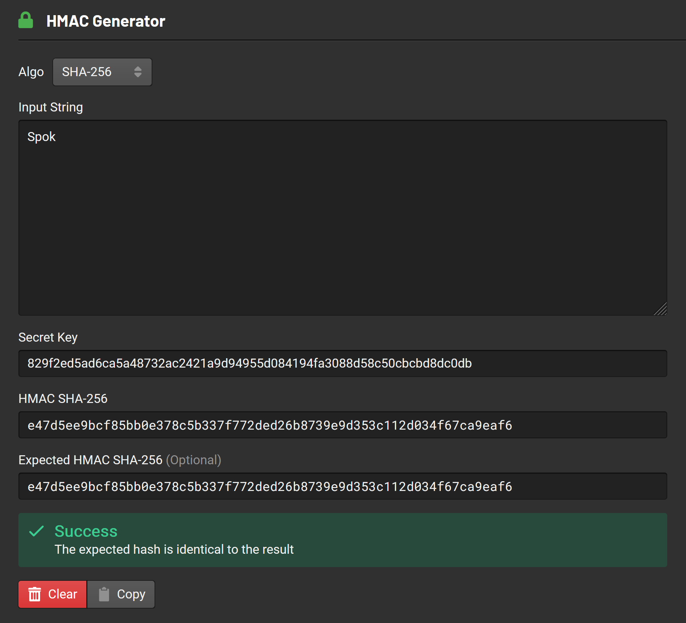
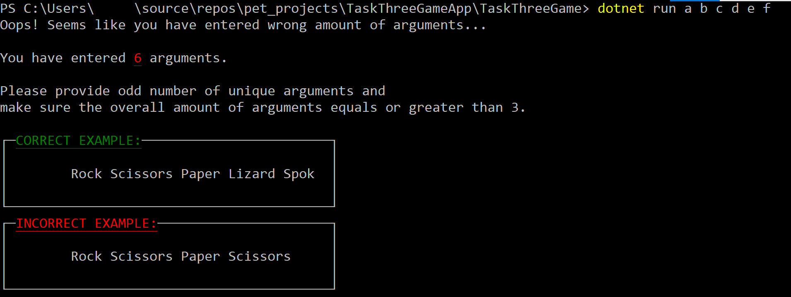
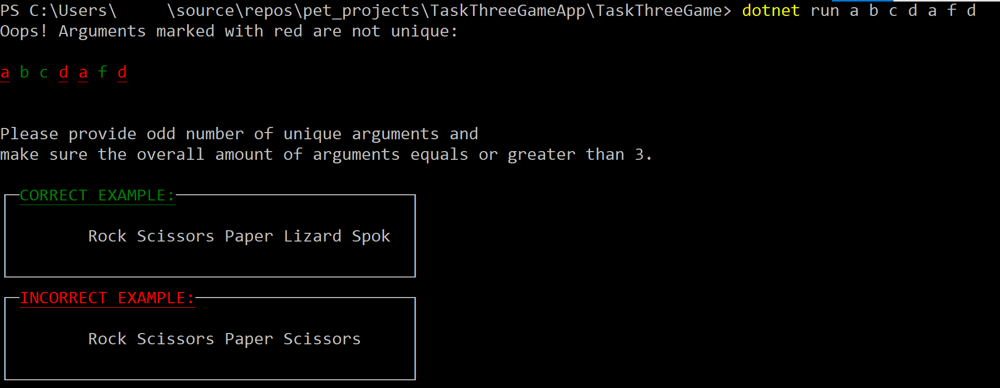

# Task 3 | A general non-transitive one-move game


  

The Console app is written in C# and provides game functionality.\
User provides possible moves sequence via command line arguments at startup.

Arguments have to be unique. Amount of arguments must be  grater or equal to 3 and it must be an odd number.

>
> <a href="https://youtu.be/puleEkWpUNk"><u><i>Demo video on YouTube</i></u></a>
>=
---

<details>
  <summary><i>UI Screenshots</i></summary>









</details>

---
## Start here

To run the app navigate to the project folder and use the following command:

```

    dotnet run

```

To run the game you have to specify your moves via command line arguments.\
For example, if you want to play Rock Paper Scissors variant of the game you \
should use the following command:

```

    dotnet run Rock Paper Scissors

```

You can use any number of arguments if the number is greater than 1 and\
is an odd number

---

You can use this <a href="https://appdevtools.com/hmac-generator"><u><i>Online HMAC generator</i></u></a> to check if the computer was hones\
and did not change it's move.

